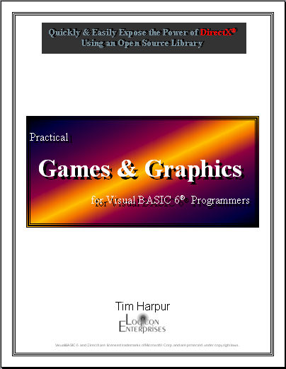



## Games and Graphics

### Description

A toolkit w/300+ page manual for designing advanced arcade style 2D/3D/ISOmetric DirectX games. May be redistributed free despite what is in documentation.

FREE DirectX Graphical VisualBasic Game Design Manual and Library.
 
### More Info
 
Must have DirectX7 or better installed on target machine.

             |
---                |---
**Submitted On**   |2003-07-19 08:28:12
**By**             |[Tim Harpur](https://github.com/Planet-Source-Code/PSCIndex/blob/master/ByAuthor/tim-harpur.md)
**Level**          |Advanced
**User Rating**    |5.0 (145 globes from 29 users)
**Compatibility**  |VB 5\.0, VB 6\.0
**Category**       |[Games](https://github.com/Planet-Source-Code/PSCIndex/blob/master/ByCategory/games__1-38.md)
**World**          |[Visual Basic](https://github.com/Planet-Source-Code/PSCIndex/blob/master/ByWorld/visual-basic.md)
**Archive File**   |[Games\_and\_1617537192003\.zip](https://github.com/Planet-Source-Code/tim-harpur-games-and-graphics__1-47034/archive/master.zip)

### API Declarations

Requires DirectX 7 or better. Must include project reference to the Visual Basic DirectX 7 Type library.

